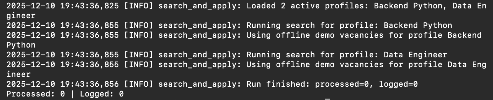

# Job Application Automation (Demo)

## Highlights

- Integration with a job-board API (demo mode, no real platform secrets).
- SQLite-based application logging.
- OpenAI-powered cover letters (with deterministic dry-run mode).
- Typed models and basic tests (pytest).
- Offline demo mode: uses synthetic vacancies instead of real API calls when `DRY_RUN` is enabled.

## Screenshots

A public, security-safe demo of a job-board auto-apply bot. The real production system targets a Russian job-board API and powers automated searches, vacancy enrichment, OpenAI-generated cover letters, and SQLite logging. This repository mirrors the architecture and developer experience while removing sensitive logic and data.

## Architecture
- `src/search_and_apply_demo.py` — CLI orchestrator for a single run.
- `src/hh_client.py` — minimal job-board API client (`/vacancies`, `/vacancies/{id}`, `/responses`).
- `src/openai_client.py` — wrapper around OpenAI Chat Completions with `dry_run` support.
- `src/db.py` — SQLite helper for schema init, demo data, and logging applications.
- `src/config.py` — loads `.env` and JSON configs (search profiles, active mode).
- `src/logging_utils.py` and `src/prompts_demo.py` — logging setup and safe prompt templates.
- `src/models/` — dataclasses describing vacancies and application logs.
- Additional docs live in `docs/ARCHITECTURE.md`, `docs/FLOWS.md`, `docs/REAL_PROJECT_DIFF.md`, and `docs/LOG_EXAMPLE.md`.

## Used technologies
- Python 3.x
- requests (HTTP client)
- SQLite (via `sqlite3`)
- OpenAI API (or deterministic stub in `dry_run`)
- python-dotenv for configuration management

## How to run locally
1. Clone the repository:  
   `git clone https://github.com/workflowarsenynn/job-application-automation-portfolio.git`
2. Create a virtual environment and install dependencies:  
   `python3 -m venv .venv && .venv/bin/pip install -r requirements.txt`
3. Copy environment template and fill in placeholders:  
   `cp .env.example .env`  
   Provide your own `JOB_BOARD_*` credentials and `OPENAI_API_KEY` (keep them secret).
4. Initialize the database schema:  
   `python -m src.db --init`  
   Optionally load demo data: `python -m src.db --demo`
5. Run the demo workflow:  
   `python -m src.search_and_apply_demo`  
   By default `active_mode_demo.json` enables `dry_run`, so applications are not actually sent.

## Demo scenario
- Two search profiles are enabled (`backend_python`, `data_engineer`) with a small application limit.
- When `dry_run` is enabled (default), vacancies come from the built-in offline demo generator and no HTTP calls are made to the abstract job-board API.
- In full mode (`DRY_RUN=false`), the client can talk to a real job-board API at the same endpoints (`/vacancies`, `/vacancies/{id}`, `/responses`) if you point `JOB_BOARD_API_BASE_URL` to a real host.
- Full vacancy details are fetched individually (offline or via API), and a cover letter is generated per vacancy.
- In `dry_run` mode the OpenAI client returns a deterministic stub and no API calls are sent to `/responses`.
- Each attempt is logged into SQLite with a snippet of the cover letter.
- A synthetic log excerpt illustrating the flow is available in `docs/LOG_EXAMPLE.md`.

## Real project vs demo
- Production includes Telegram notifications, multi-account handling, advanced anti-abuse and token management, scheduling/daemonization, and richer analytics.
- These features are intentionally removed or simplified here for safety; see `docs/REAL_PROJECT_DIFF.md` for details.

## Security & privacy
- No real keys, tokens, or user data are present in this repository.
- `.env.example` contains only placeholders; keep your real `.env` private and out of version control.
- API base URL defaults to a neutral domain (`https://api.example.com`) to avoid leaking internal hosts.
